# RESULTS

## Demographic Characteristics of Orthopaedic Injuries Sustained in Motorcycle Accidents at Queen Elizabeth Hospital

A total of 125 patients with motorcycle accidents were recruited into the study. Among those excluded from the study were those with missing information in their file (e.g., age, radiographs) and those who were unable to give consent and had no guardians to consent on their behalf. The majority (75.2%) of them were male, and 24.8% were female (M:F ratio 3:1). The mean age of the patients was 34.8±10.5 years, with a median age of 32 years (Table 6) and an age range of 21–61 years. The modal age group affected was 21–30 years (45.2%).

Sixty-nine (44.8%) presented at the hospital directly from the scene of the crash, while 56 (55.2%) were referrals from other facilities. The majority of the patients (71.2%) resided within Blantyre district and had attained primary (48.4%), secondary (33%), tertiary (15.3%) level education, or no schooling (3.2%). The majority (45.6%) were operators (riders), followed by passengers (37.6%) and pedestrians (16.8%).

| Role       | Frequency | Percentage |
|------------|-----------|------------|
| Passenger  | 47        | 37.6%      |
| Pedestrian | 21        | 16.8%      |
| Operator   | 57        | 45.6%      |

Approximately half of the patients (51.6%) were kabaza riders by occupation. Of these, 36 (89.6%) were operating with no driving license. The average years of experience of the riders was 6.1±3.8 years. There were no female motorcycle rider patients found in this study. A third of the patients reported their occupation as casual laborers, and the rest included students, farmers, and self-employed persons.

### Class of Injuries by Victim

| Characteristic      | Level         | All Patients N (%) | Motorcycle Rider/Operator | Pedestrian | Passenger | p-value¹ |
|---------------------|---------------|---------------------|---------------------------|------------|-----------|----------|
| **Total N (%)**     |               | 125 (100%)          | 57 (45.6%)                | 21 (16.8%) | 47 (37.6%)|          |
| **Age**             | Median (IQR²) |                     |                           |            |           | <0.001   |
| **Age Group**       | ≤20 years     | 11 (7.2%)           | 3 (5.3%)                  | 1 (5.3%)   | 7 (14.9%) | <0.001   |
|                     | 21–30 years   | 39 (31.2%)          | 21 (36.8%)                | 4 (21.1%)  | 14 (29.8%)|          |
|                     | 31–40 years   | 32 (25.6%)          | 19 (33.3%)                | 3 (15.8%)  | 10 (21.3%)|          |
|                     | 41–50 years   | 21 (16.8%)          | 7 (12.3%)                 | 3 (15.8%)  | 11 (23.4%)|          |
|                     | >50 years     | 21 (16.8%)          | 7 (12.3%)                 | 8 (42.1%)  | 5 (10.6%) |          |
| **Sex**             | Male          | 94 (75.2%)          | 57 (100.0%)               | 12 (57.1%) | 25 (53.2%)| <0.001   |
|                     | Female        | 31 (24.8%)          | 0 (0.0%)                  | 9 (42.9%)  | 22 (46.8%)|          |
| **Occupation**      | Motorcycle Rider | 39 (31.2%)       | 39 (31.2%)                | 2 (9.5%)   | 16 (34.0%)| 0.0003   |
|                     | Housewife     | 1 (0.8%)            | 0 (0.0%)                  | 1 (4.8%)   | 0 (0.0%)  |          |
|                     | Casual Laborer| 34 (27.2%)          | 12 (21.1%)                | 9 (42.9%)  | 13 (27.7%)|          |
|                     | Farmer        | 8 (6.4%)            | 3 (5.3%)                  | 2 (9.5%)   | 3 (6.4%)  |          |
|                     | Self-employed | 26 (20.8%)          | 4 (7.0%)                  | 6 (28.6%)  | 16 (34.0%)|          |
|                     | Student       | 6 (4.8%)            | 3 (5.3%)                  | 1 (4.8%)   | 2 (4.3%)  |          |
| **Education Level** | None          | 4 (3.2%)            | 0 (0.0%)                  | 0 (0.0%)   | 4 (8.5%)  | 0.331    |
|                     | Primary       | 60 (48.4%)          | 28 (50.0%)                | 15 (71.4%) | 17 (36.2%)|          |
|                     | Secondary     | 41 (33.1%)          | 21 (37.5%)                | 4 (19.0%)  | 16 (34.0%)|          |
|                     | Tertiary      | 19 (15.3%)          | 7 (12.5%)                 | 2 (9.5%)   | 10 (21.3%)|          |
| **Referral Status** | No            | 56 (44.8%)          | 26 (45.6%)                | 8 (38.1%)  | 22 (46.8%)| 0.7891   |
|                     | Yes           | 69 (55.2%)          | 31 (54.4%)                | 13 (61.9%) | 25 (53.2%)|          |
| **Mode of Evacuation** | Ambulance  | 30 (24.0%)          | 12 (21.1%)                | 3 (14.3%)  | 15 (31.9%)| 0.0265   |
|                     | Police Vehicle | 7 (5.6%)           | 6 (10.5%)                 | 1 (4.8%)   | 0 (0.0%)  |          |
|                     | Private Vehicle | 79 (63.2%)        | 35 (61.4%)                | 14 (66.7%) | 30 (63.8%)|          |
| **Time-to-Presentation at QECH (hours)** | Median (IQR) | 3.4 (2.0–6.0) | 3.0 (2.0–6.0) | 3.6 (2.0–6.0) | 3.2 (1.9–5.3) | 0.641 |

¹ Chi-Squared (χ²) or Fisher’s Exact test p-value; statistically significant codes are in bold: p <0.01; p <0.05  
² IQR: interquartile range (25th and 75th percentiles)

## Circumstances of the injuries

Most of the motorcycle crashes occurred within Blantyre (n=89 patients, 71.2%). Bangwe (n=15, 12.0%) and Machinjiri (n=10, 8.0%).The commonest scenes (road) of  were M1 road (n=9 patients, 8.57%), Machinjiri road (n=5 patients, 4.76%) and Midima Road (n=4 patients, 3.80%). Most of the Motor cycle accidents occurred between 07:00 hours and 19:00 hours (n=90, 72.0%). Motorcycle operators (riders) constituted about half of the injured patients (n=57, 45.6%), while passengers and pedestrians comprised 37.6% (47 patients) and 16.8% (21 patients) respectively. Majority of the injured patients were evacuated from the scene of accident by Private (n=79 patients, 63.2%), while the rest were evacuated by ambulance (n=30 patients, 24.0%) and police vehicles (n=7 patients, 5.6%). The median time from injury to arrival to hospital was 3.4 hours (IQR 2-6 hours) The median time from injury to arrival to hospital was 2.8 hours (IQR 6.0 hours).

## Mechanism of injury in MCC-related musculoskeletal injuries

The commonest motorcycle crash type was collision with a motor vehicle (n=42 patients, 35.3%), followed by collision with motorcycle (n=18 patients, 15.1%), fall from motorcycle (n=35 patients, 29.4%) and collision with a animal (n=3 patient, 2.5%). The most predominant mechanism of injury was collision (n=60 patients, 50.4%), (p<0.001).

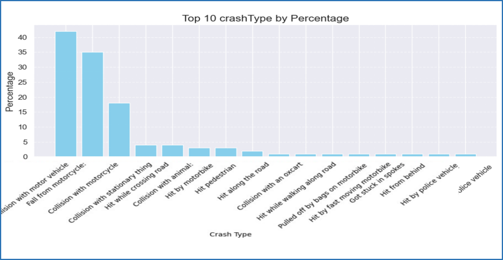 

## Anatomical Distribution of Fractures Sustained in Motorcycle Injuries

Out of the total patients assessed, the majority (n=75, 47.8%) sustained injuries on the right limb, while left limb injuries were observed in 67 patients (42.7%), and bilateral limb injuries were present in 15 patients (9.6%). Unilateral injuries accounted for the vast majority of cases (n=142, 90.4%). 

The majority of fractures were observed in the lower-limb region, accounting for 60.2% of the total fractures, followed by the upper-limb region with 36.6%, while the spine and pelvis regions contributed 2.5% and 0.6%, respectively. In the lower-limb, the tibia was the most commonly fractured bone (49.5%), followed by the fibula (22.7%) and femur (18.6%). In the upper-limb, the radius accounted for the highest number of fractures (52.5%), followed by the humerus (27.1%) and ulna (11.9%). Fractures in the pelvis and spine regions were rare, with only 1 and 4 cases, respectively.

### Fracture Distribution by Role

| Region       | Passenger (N, %) | Pedestrian (N, %) | Operator (N, %) | Total (N, %) | p-value |
|--------------|-------------------|-------------------|------------------|--------------|---------|
| Lower-limb   | 38 (39.2%)        | 15 (55.6%)        | 44 (51.2%)       | 97 (54.5%)   | < 0.005 |
| Pelvis       | 1 (1.0%)          | 0 (0.0%)          | 0 (0.0%)         | 1 (0.6%)     |         |
| Spine        | 3 (3.1%)          | 0 (0.0%)          | 1 (1.2%)         | 4 (2.3%)     |         |
| Upper-limb   | 23 (23.7%)        | 11 (40.7%)        | 25 (29.1%)       | 59 (33.2%)   |         |
| **Total**    | 65 (100.0%)       | 27 (100.0%)       | 86 (100.0%)      | 178 (100.0%) |         |

### Fracture Characteristics

| Category       | Count | Percentage |
|----------------|-------|------------|
| Multiple       | 52    |            |
| Single         | 58    |            |
| Closed         | 66    |            |
| Open           | 49    |            |

### Bone-Specific Fracture Distribution

| Region       | Bone       | No. of Fractures (%) | Overall No. of Fractures (%) |
|--------------|------------|----------------------|------------------------------|
| Lower-limb   | Femur      | 18 (18.6%)          | 97 (60.2%)                   |
|              | Patella    | 1 (1.0%)            |                              |
|              | Tibia      | 48 (49.5%)          |                              |
|              | Fibula     | 22 (22.7%)          |                              |
|              | Foot       | 8 (8.2%)            |                              |
| Upper-limb   | Humerus    | 16 (27.1%)          | 59 (36.6%)                   |
|              | Radius     | 31 (52.5%)          |                              |
|              | Ulna       | 7 (11.9%)           |                              |
|              | Hand       | 5 (8.5%)            |                              |
|              | Clavicle   | 1 (0.2%)            |                              |
| Pelvis       |            | 1 (0.6%)            | 1 (0.6%)                     |
| Spine        |            | 4 (2.5%)            | 4 (2.5%)                     |

### Distribution of Musculoskeletal Injuries Across Anatomical Regions

| Region       | Overall (N, %) | Bilateral (N, %) | Unilateral Right (N, %) | Unilateral Left (N, %) | p-value |
|--------------|----------------|------------------|--------------------------|-------------------------|---------|
| Lower-limb   | 97 (62.2%)     | 4 (36.4%)        | 54 (62.8%)              | 39 (66.1%)             | 0.172   |
| Upper-limb   | 59 (37.8%)     | 7 (63.6%)        | 32 (37.2%)              | 20 (33.9%)             | 0.172   |
| **Total**    | 156 (100%)     | 11 (100%)        | 86 (100%)               | 59 (100%)              |         |

### Fracture Types and Classification

Most of the fractures were of the closed type (n=127 fractures, 56.7%). The rest were open, and of Gustilo-Anderson class I (n=5 fractures, 2.2%), II (n=40 fractures, 17.9%), and III (n=52 fractures, 23.2%). Among the open fractures graded using the Gustilo-Anderson classification, 4 were Type 1, 18 were Type 2 (including 1 labeled as G2), 9 were Type 3A, and 3 were Type 3B. Additionally, 14 open fractures had no specified Gustilo grade.

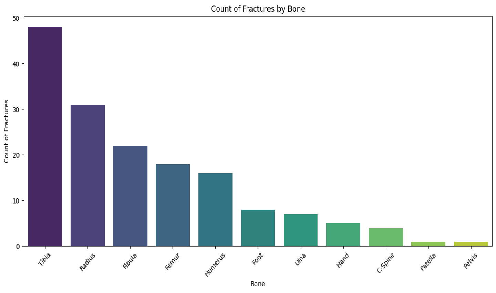

## The Pattern and Severity of MCC-Related Musculoskeletal Injuries Based on AO/OTA Classification and Patient Position Category

The motorcycle operator predominantly suffered musculoskeletal injuries, with long bone fractures being the most common. Diaphyseal fractures were predominant among operators across all long bones, especially in the lower limbs, with the tibia, femur, and fibula being the most frequently injured. For instance, tibial fractures were observed in 37.5% of patients, with operators accounting for 33.3% of these injuries, primarily in the diaphyseal segment. Pedestrians showed a predisposition to diaphyseal wedge fractures of the tibia, with 8.3% of tibial fractures being wedge-type.

In the humerus, simple diaphyseal fractures were the most common pattern, observed in 12.5% of cases. Both operators and passengers were affected, with operators accounting for 6.2% of these fractures and passengers for 12.5%. Interestingly, no pedestrian was found to have suffered a humerus fracture.

Radius and ulna fractures were more prevalent among operators, with multi-fragmented and wedged patterns being common. For example, 41.9% of radial fractures were observed in operators, with multi-fragmented fractures accounting for 9.7%. Hand and foot fractures were less frequent but showed a higher prevalence of multi-fragmented patterns in passengers, such as 25.0% of hand fractures being multi-fragmented.

APC fractures were rare, with only one case observed in a passenger.

### Humerus Fracture AO/OTA Distribution By Role

| Roles          | Passenger (%) | Pedestrian (%) | Operator (%) | All Patients (%) |
|----------------|---------------|----------------|--------------|------------------|
| **11**         | 3 (18.8%)     | 1 (6.2%)       | 1 (6.2%)     | 5 (31.2%)        |
| **12**         | 2 (12.5%)     | 0 (0.0%)       | 1 (6.2%)     | 3 (18.8%)        |
| **13**         | 1 (6.2%)      | 2 (12.5%)      | 5 (31.2%)    | 8 (50.0%)        |

### Humerus OA/OTA Fracture Type Distribution

| Fracture Type  | Multifragmented (%) | Simple (%) | Wedged (%) | All Patients (%) |
|----------------|---------------------|------------|------------|------------------|
| **11**         | 3 (18.8%)           | 2 (12.5%)  | 0 (0.0%)   | 5 (31.2%)        |
| **12**         | 1 (6.2%)            | 2 (12.5%)  | 0 (0.0%)   | 3 (18.8%)        |
| **13**         | 5 (31.2%)           | 2 (12.5%)  | 1 (6.2%)   | 8 (50.0%)        |

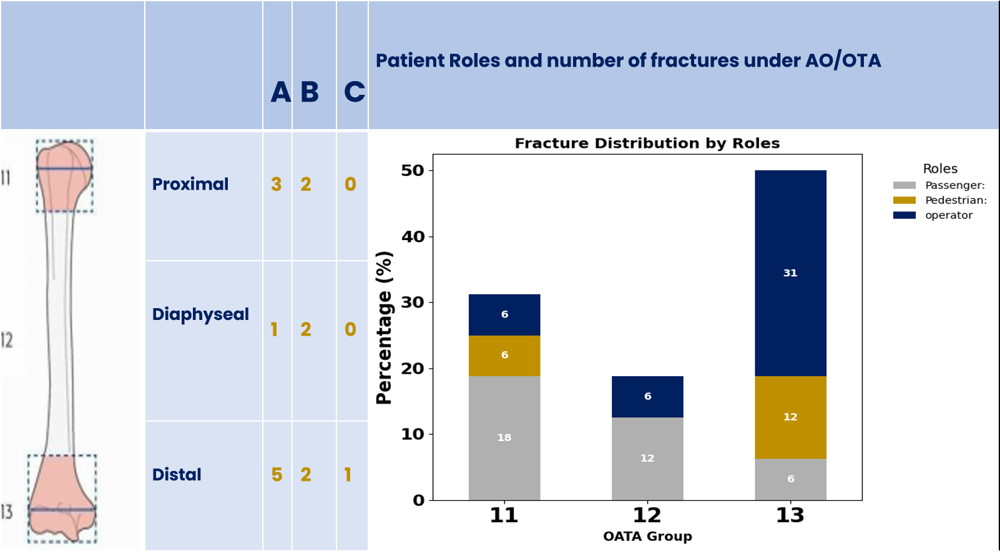

### Radius Fracture Distribution

| Fracture Type  | Multifragmented (%) | Simple (%) | Wedged (%) | All Patients (%) |
|----------------|---------------------|------------|------------|------------------|
| **2r1**        | 2 (6.5%)            | 5 (16.1%)  | 2 (6.5%)   | 9 (29.0%)        |
| **2r2**        | 0 (0.0%)            | 6 (19.4%)  | 3 (9.7%)   | 9 (29.0%)        |
| **2r3**        | 3 (9.7%)            | 5 (16.1%)  | 5 (16.1%)  | 13 (41.9%)       |

| Roles          | Passenger (%) | Pedestrian (%) | Operator (%) | All Patients (%) |
|----------------|---------------|----------------|--------------|------------------|
| **2r1**        | 4 (12.9%)     | 1 (3.2%)       | 4 (12.9%)    | 9 (29.0%)        |
| **2r2**        | 6 (19.4%)     | 1 (3.2%)       | 2 (6.5%)     | 9 (29.0%)        |
| **2r3**        | 6 (19.4%)     | 2 (6.5%)       | 5 (16.1%)    | 13 (41.9%)       |

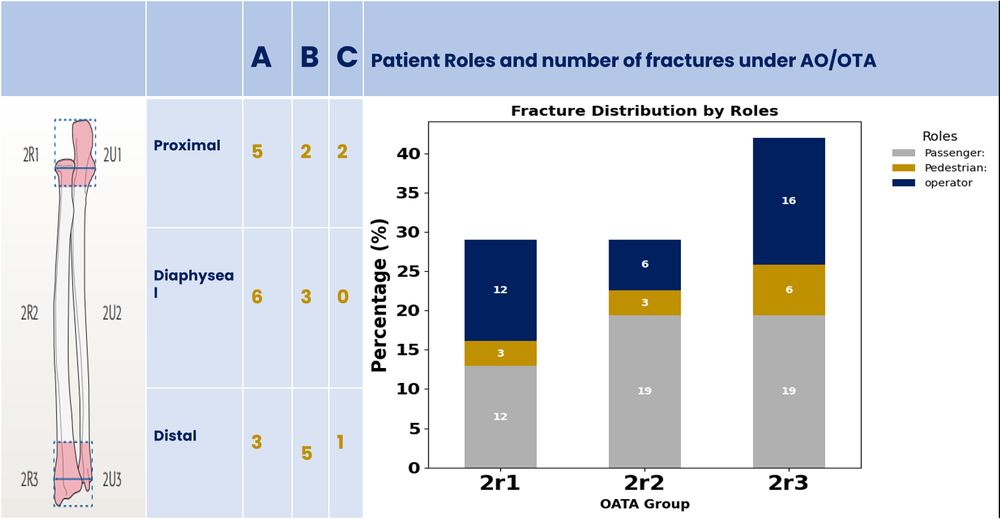

### Ulna Fracture Distribution

| Fracture Type  | Simple (%) | Wedged (%) | All Patients (%) |
|----------------|------------|------------|------------------|
| **2u1**        | 0 (0.0%)   | 1 (14.3%)  | 1 (14.3%)        |
| **2u2**        | 1 (14.3%)  | 0 (0.0%)   | 1 (14.3%)        |
| **2u3**        | 4 (57.1%)  | 1 (14.3%)  | 5 (71.4%)        |

| Roles          | Passenger (%) | Pedestrian (%) | Operator (%) | All Patients (%) |
|----------------|---------------|----------------|--------------|------------------|
| **2u1**        | 0 (0.0%)      | 0 (0.0%)       | 1 (14.3%)    | 1 (14.3%)        |
| **2u2**        | 0 (0.0%)      | 1 (14.3%)      | 0 (0.0%)     | 1 (14.3%)        |
| **2u3**        | 1 (14.3%)     | 1 (14.3%)      | 3 (42.9%)    | 5 (71.4%)        |

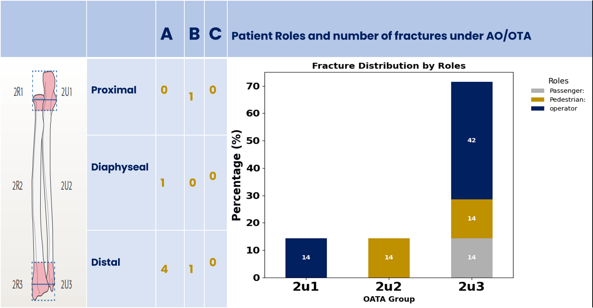

### Hand Fracture Distribution

| Fracture Type  | Multifragmented (%) | Simple (%) | All Patients (%) |
|----------------|---------------------|------------|------------------|
| **78**         | 1 (25.0%)           | 2 (50.0%)  | 3 (75.0%)        |
| **79**         | 0 (0.0%)            | 0 (0.0%)   | 1 (25.0%)        |

| Roles          | Pedestrian (%) | Operator (%) | All Patients (%) |
|----------------|----------------|--------------|------------------|
| **78**         | 2 (50.0%)      | 1 (25.0%)    | 3 (75.0%)        |
| **79**         | 0 (0.0%)       | 1 (25.0%)    | 1 (25.0%)        |

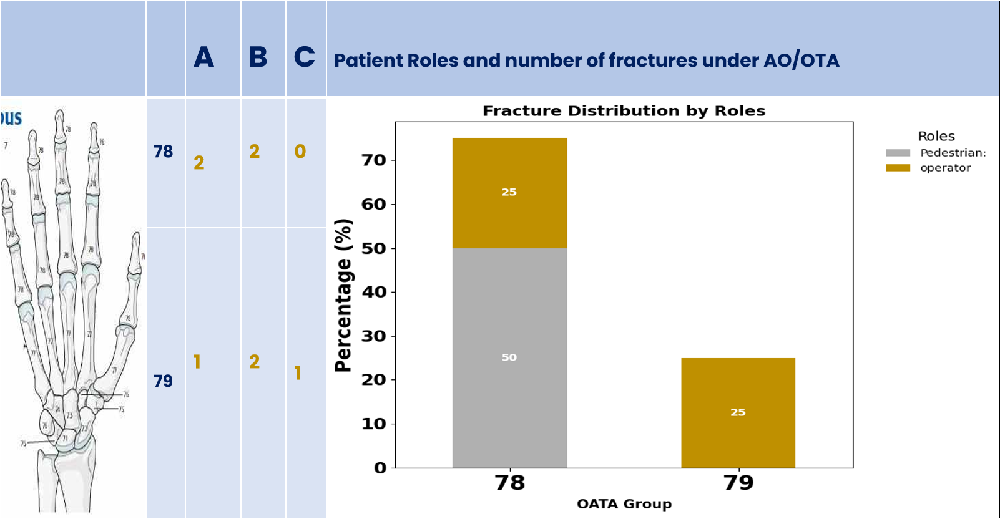

### Femur Fracture Distribution

| Fracture Type  | Multifragmented (%) | Simple (%) | Wedged (%) | All Patients (%) |
|----------------|---------------------|------------|------------|------------------|
| **31**         | 3 (16.7%)           | 3 (16.7%)  | 0 (0.0%)   | 6 (33.3%)        |
| **32**         | 2 (11.1%)           | 1 (5.6%)   | 2 (11.1%)  | 5 (27.8%)        |
| **33**         | 5 (27.8%)           | 0 (0.0%)   | 2 (11.1%)  | 7 (38.9%)        |

| Roles          | Passenger (%) | Pedestrian (%) | Operator (%) | All Patients (%) |
|----------------|---------------|----------------|--------------|------------------|
| **31**         | 3 (16.7%)     | 0 (0.0%)       | 3 (16.7%)    | 6 (33.3%)        |
| **32**         | 2 (11.1%)     | 1 (5.6%)       | 2 (11.1%)    | 5 (27.8%)        |
| **33**         | 2 (11.1%)     | 3 (16.7%)      | 2 (11.1%)    | 7 (38.9%)        |

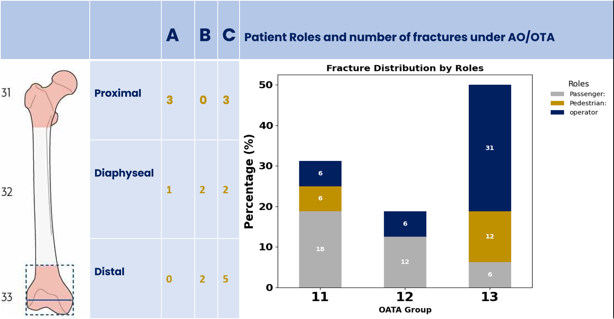

### Tibia Fracture Distribution

| Fracture Type  | Multifragmented (%) | Simple (%) | Wedged (%) | All Patients (%) |
|----------------|---------------------|------------|------------|------------------|
| **4t1**        | 13 (27.1%)          | 1 (2.1%)   | 4 (8.3%)   | 18 (37.5%)       |
| **4t2**        | 6 (12.5%)           | 8 (16.7%)  | 4 (8.3%)   | 18 (37.5%)       |
| **4t3**        | 5 (10.4%)           | 5 (10.4%)  | 2 (4.2%)   | 12 (25.0%)       |

| Roles          | Passenger (%) | Pedestrian (%) | Operator (%) | All Patients (%) |
|----------------|---------------|----------------|--------------|------------------|
| **4t1**        | 8 (16.7%)     | 5 (10.4%)      | 5 (10.4%)    | 18 (37.5%)       |
| **4t2**        | 2 (4.2%)      | 0 (0.0%)       | 16 (33.3%)   | 18 (37.5%)       |
| **4t3**        | 8 (16.7%)     | 2 (4.2%)       | 2 (4.2%)     | 12 (25.0%)       |

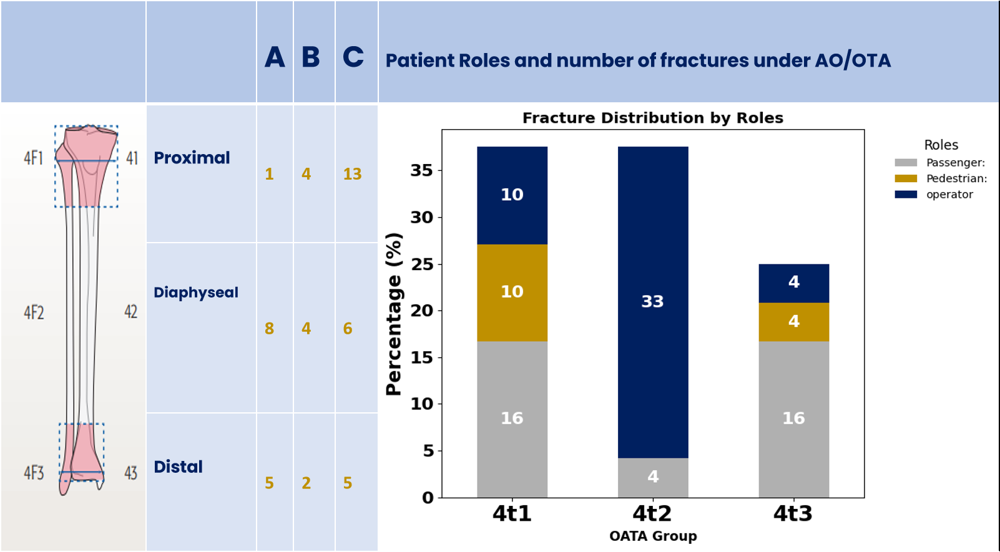

### Fibula Fracture Distribution

| Fracture Type  | Multifragmented (%) | Simple (%) | Wedged (%) | All Patients (%) |
|----------------|---------------------|------------|------------|------------------|
| **4f1**        | 4 (18.2%)           | 1 (4.5%)   | 0 (0.0%)   | 5 (22.7%)        |
| **4f2**        | 2 (9.1%)            | 6 (27.3%)  | 3 (13.6%)  | 11 (50.0%)       |
| **4f3**        | 3 (13.6%)           | 3 (13.6%)  | 0 (0.0%)   | 6 (27.3%)        |

| Roles          | Passenger (%) | Pedestrian (%) | Operator (%) | All Patients (%) |
|----------------|---------------|----------------|--------------|------------------|
| **4f1**        | 3 (13.6%)     | 0 (0.0%)       | 2 (9.1%)     | 5 (22.7%)        |
| **4f2**        | 4 (18.2%)     | 2 (9.1%)       | 5 (22.7%)    | 11 (50.0%)       |
| **4f3**        | 1 (4.5%)      | 1 (4.5%)       | 4 (18.2%)    | 6 (27.3%)        |

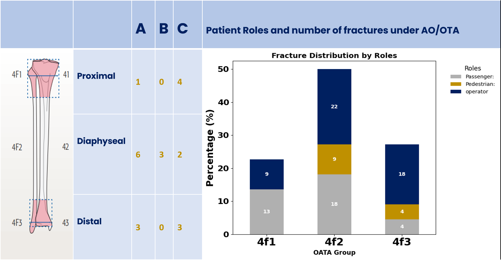

### Foot Fracture Distribution

| Fracture Type  | Multifragmented (%) | Simple (%) | All Patients (%) |
|----------------|---------------------|------------|------------------|
| **81**         | 2 (33.3%)           | 0 (0.0%)   | 2 (33.3%)        |
| **87**         | 2 (33.3%)           | 0 (0.0%)   | 2 (33.3%)        |
| **88**         | 1 (16.7%)           | 1 (16.7%)  | 2 (33.3%)        |

| Roles          | Passenger (%) | Operator (%) | All Patients (%) |
|----------------|---------------|--------------|------------------|
| **81**         | 1 (16.7%)     | 1 (16.7%)    | 2 (33.3%)        |
| **87**         | 2 (33.3%)     | 0 (0.0%)     | 2 (33.3%)        |
| **88**         | 1 (16.7%)     | 1 (16.7%)    | 2 (33.3%)        |

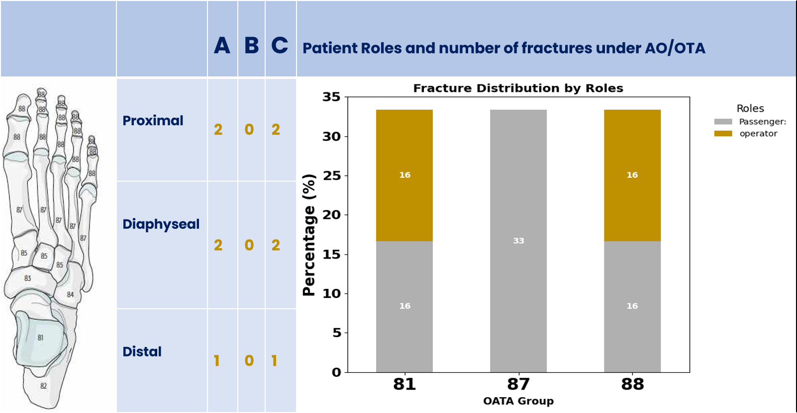

### Pelvis Fracture Distribution

| Fracture Type  | Simple (%) | All Patients (%) |
|----------------|------------|------------------|
| **APC**        | 1 (100.0%) | 1 (100.0%)       |

| Roles          | Passenger (%) | All Patients (%) |
|----------------|---------------|------------------|
| **APC**        | 1 (100.0%)    | 1 (100.0%)       |

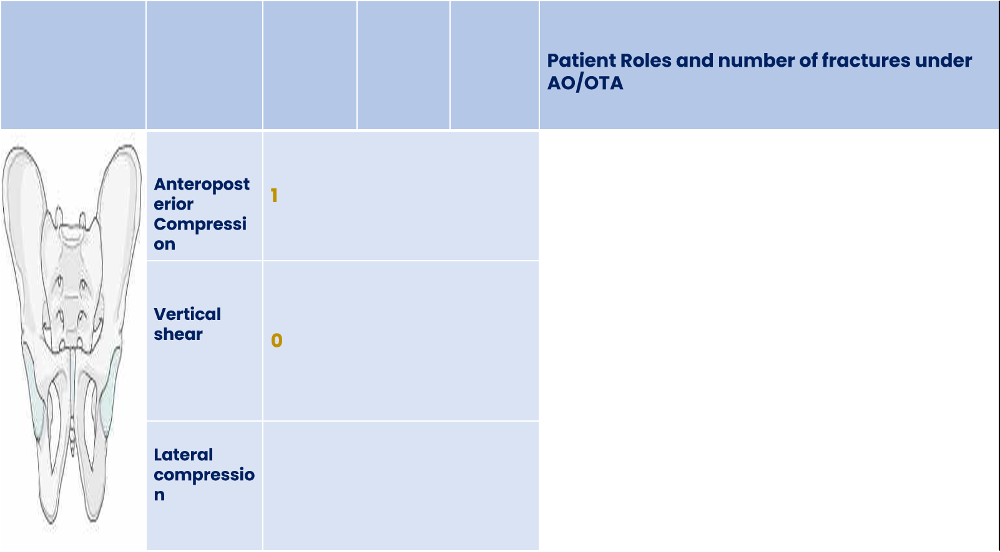
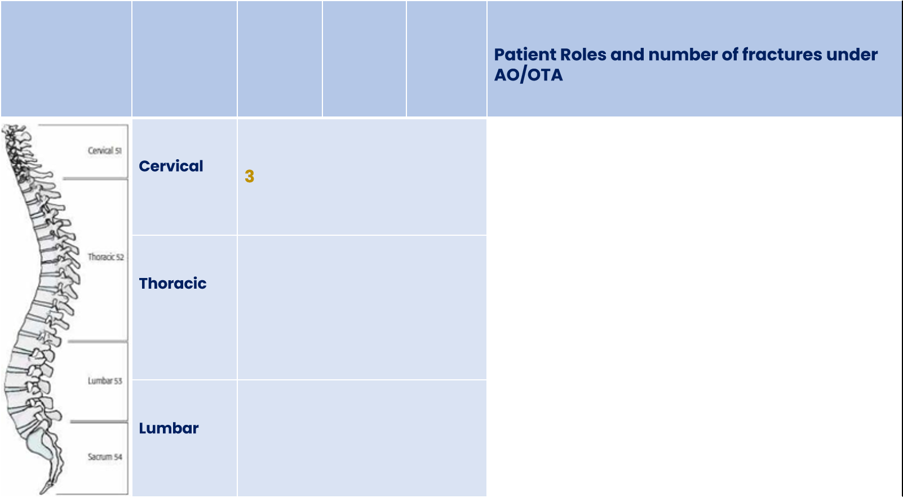